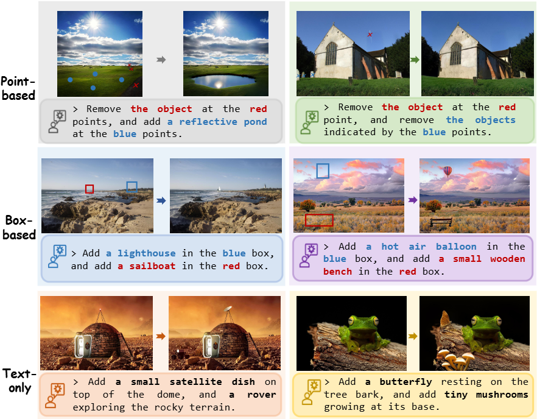
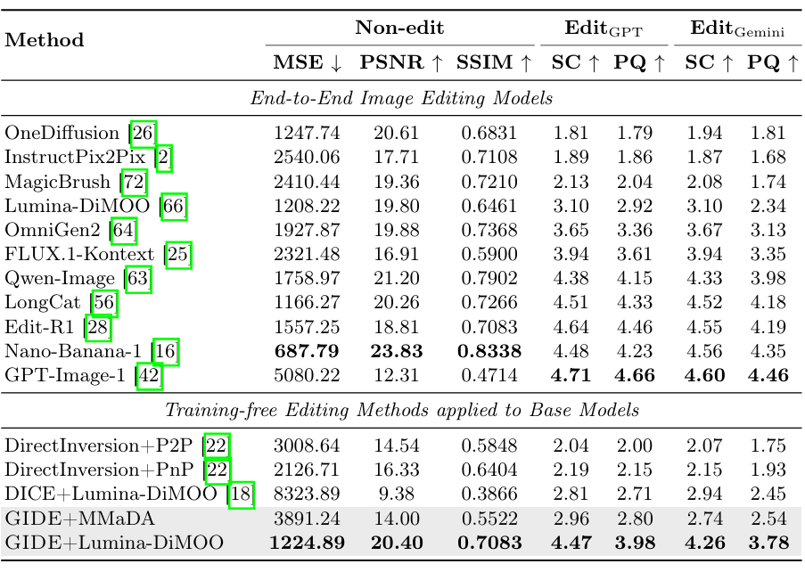

# GIDE

## Overview

Diffusion Large Language Models (DLLMs) show strong multi-modal generation ability, but precise **training-free image editing** remains difficult due to their discrete token space.  
To address this, we propose **GIDE (Grounded Inversion for DLLM Image Editing)**, a unified framework with three stages: grounding, inversion, and refinement.  
GIDE introduces a discrete noise inversion mechanism to preserve structure and background consistency while supporting diverse editing instructions (text, point, and box).  
We also introduce **GIDE-Bench**, a benchmark with 805 compositional editing scenarios. Experiments show clear improvements over previous training-free methods, including strong gains in **Semantic Correctness (SC)** and **Perceptual Quality (PQ)**.



## Experimental Results

The following table presents quantitative comparisons on GIDE-Bench, where GIDE significantly outperforms state-of-the-art training-free methods, improving Semantic Correctness by 51.83% and Perceptual Quality by 50.39%.



## Installation

### 1) Create and activate the environment

```bash
conda create -n GIDE python=3.12
conda activate GIDE
```

### 2) Clone this repository and install dependencies

```bash
git clone https://github.com/Zivenzhu/GIDE.git
cd GIDE
pip install -r requirements.txt
```

You are also welcome to access our **GIDE-Bench** on Hugging Face: [](https://huggingface.co/datasets/Zifeng618/GIDE-Bench)

### 3) Install segmentation foundation models

You need to install both **SAM 2** and **SAM 3**.

#### SAM 2

```bash
git clone https://github.com/facebookresearch/sam2.git
mv sam2 sam2_repo
cd sam2_repo
pip install -e .
```

#### SAM 3

```bash
git clone https://github.com/facebookresearch/sam3.git
mv sam3 sam3_repo
cd sam3_repo
pip install -e .
pip install -e ".[notebooks]"
```

## Run This Repository

### Evaluate our method (GIDE)

```bash
cd evaluation
python3 evaluate_ours.py --lambda1-ratio 0.2 --use-grounding-module
```

### Run ablation experiments

#### Without Discrete Inversion

```bash
python3 evaluate_ours.py --lambda1-ratio 0.2 --use-grounding-module --w-o-inversion
```

#### Without Multimodal Spatial Grounding

```bash
python3 evaluate_ours.py --lambda1-ratio 0.2
```

#### Without High-Fidelity Visual Refinement

```bash
python3 evaluate_ours.py --lambda1-ratio 0.2 --use-grounding-module --w-o-refinement-segement
```

#### Without Intrinsic Refinement

```bash
python3 evaluate_ours.py --lambda1-ratio 0.2 --use-grounding-module --w-o-intrinsic-refinement
```

#### Without Residual Recovery

```bash
python3 evaluate_ours.py --lambda1-ratio 0.2 --use-grounding-module --w-o-residual-recovery
```

### Sensitivity analysis

You can adjust the mixing coefficient $\lambda$, which controls the strength of the introduced inversion residual $\boldsymbol{z}_t$.

For example, set $\lambda$ to 0.4:

```bash
python3 evaluate_ours.py --lambda1-ratio 0.4 --use-grounding-module
```

## Evaluate Other Methods with GIDE-Bench

For example, to evaluate **GPT-Image-1**:

```bash
python3 evaluate_gpt.py
```

Other methods can be evaluated in a similar way.

After obtaining model responses, run:  
This step computes the **Semantic Correctness (SC)** and **Perceptual Quality (PQ)** scores for each image.

```bash
python3 metrics.py
```

Then compute the average score:

```bash
python3 calculate_score.py
```
